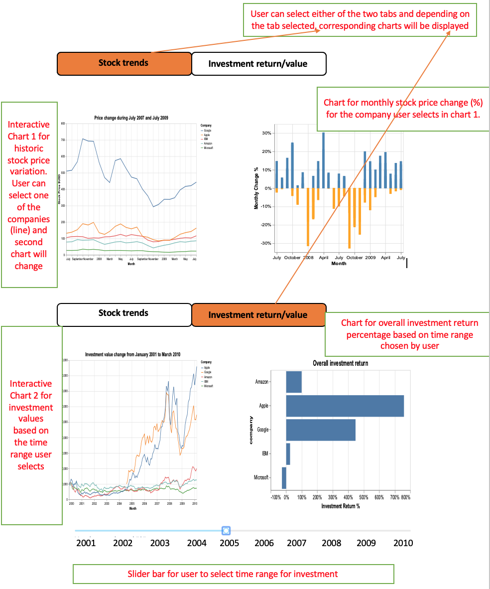

# DSCI-532_group-211_dashboards

This repository hosts the dashboard for the stock price data from the `vega-dataset`. The background and purpose of this dashboard can be found in our [proposal.](https://github.com/UBC-MDS/DSCI-532_group-211_dashboards/blob/master/Proposal.md)

### Description of the App/Dashboard

The App has two sets of charts for the users to visualize: **monthly historical stock price**, and **investment return** of five tech companies from 2000 to 2010.

- The first set of charts shows the changes in stock price of the five companies over the ten year period. The chart on the left allows users to interactively click on a specific stock and highlight the price line of the selected stock. Depending on the stock selected, the chart on the right will change correspondingly to show the monthly percentage price change for the selected company. These two charts are displayed on the "Stock trends" tab.

- The second set of charts shows the changes in investment value over time as well as investment returns given a year range which the user selects. Both charts will change interactively based on the year range selected by the user. These two charts will be displayed on the "Investmet return/value" tab.

**NOTE**   
The charts' labels and titles shown in the sketch below are based on DSCI 531 lab 4 and are solely meant for showing the dashboard prototype. This is due to the fact that we have different research questions for this project, and the labels on the  charts will change accordingly.

### Sketch for dashboard 

