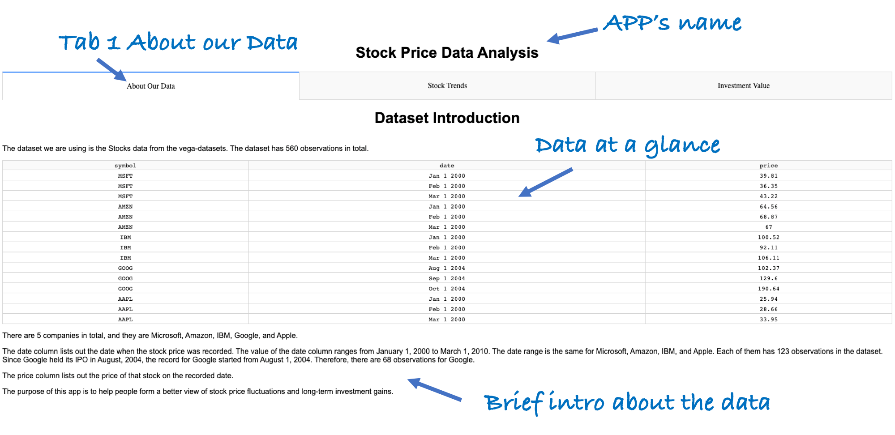
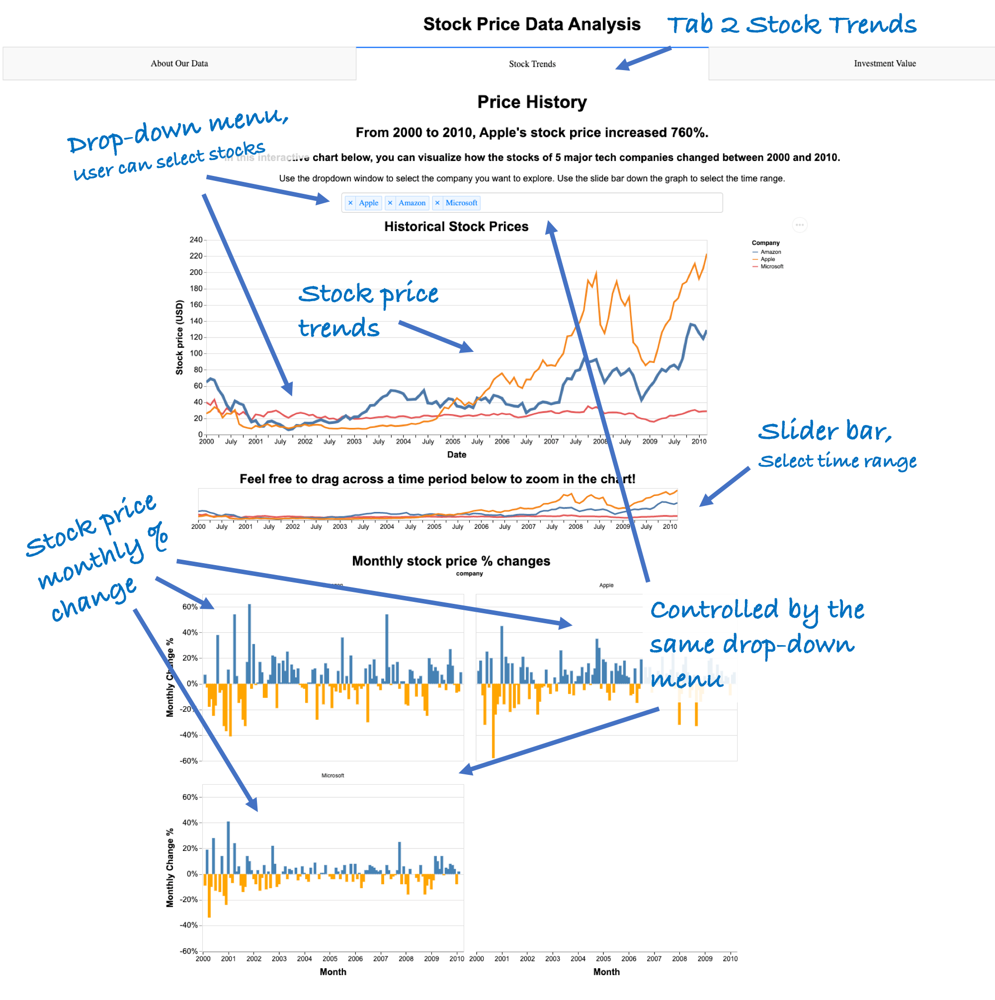
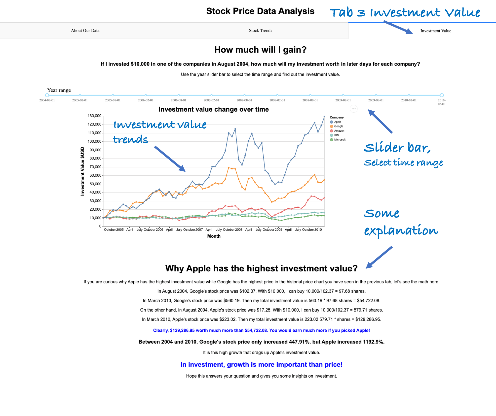

# DSCI-532_group-211_dashboards

This repository hosts the dashboard for the stock price data from the `vega-dataset`. The background and purpose of this dashboard can be found in our [proposal.](https://github.com/UBC-MDS/DSCI-532_group-211_dashboards/blob/master/Proposal.md)

**The deployed APP can be found here: https://dsci532-group-211-milestone3.herokuapp.com/**

### Description of the App/Dashboard

The APP is called **Stock Price Data Analysis**. It has three tabs and two sets of charts for users to visualize: *monthly historical stock price*, and *investment value* of five tech companies from 2000 to 2010.

- The first tab briefly introduces our dataset and the purposes of our APP. 

- The second tab is called "Stock trends". It shows the historical stock prices of five tech companies: Microsoft, Amazon, IBM, Google, and Apple, from 2000 to 2010. The first chart shows the changes in stock prices of the five companies over the ten-year period. There is a drop-down window that allows the user to choose a specific stock. After selection, the chart will display the historical price trend of that stock. There is also a slide bar down the graph that allows users to select the particular time range that they want to explore. The slide bar itself basically shows the entire trend(s) of the stock(s) selected. The graph will change accordingly to display the trend(s) in that time period. 

    Depending on the stock(s) selected in the above chart, the chart below will change correspondingly to show the monthly   percentage price changes for the selected company. 

- The third tab is called "Investment Value". It shows the changes in “hypothetical” investment value over time. The chart shows that “hypothetically”, if the user invested $10,000 in each of the 5 tech companies in August 2004 (when Google held its IPO), how much would have their investment been in later days? There is also a slide bar that allows users to select the time range and the graph will change accordingly. Below the graph, there are explanations why Google has the highest stock price, but Apple has the highest investment value. 

### Sketch for dashboard 

